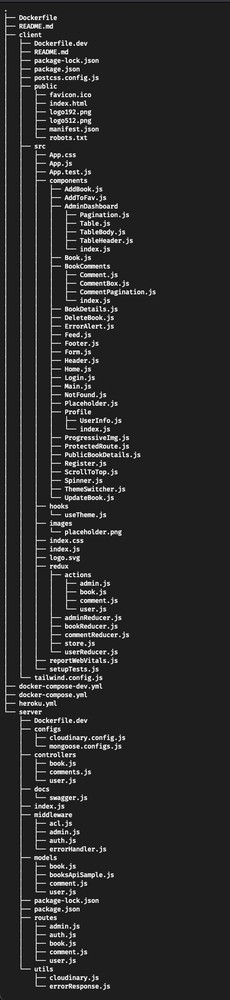

# book-store

- Application for users to browse public books from google api or books added by other users.

## Live Site

- [https://book-store-0j2u.onrender.com/](https://book-store-0j2u.onrender.com/)

## Stack

- React.js
- Node.js
- Express.js
- MongoDB

## Features

- browse public books from google api
- users need to register/login to view protected routes
- authenticated users can read all the created book
- authenticated users can create books
- authenticated users with the right permission can update the created book
- authenticated users with the right permission can delete the created book
- authenticated users can read all comments for book
- authenticated users can create a comment
- authenticated users with the right permission can update the created comment
- authenticated users with the right permission can delete the created comment
- authenticated users can add/remove books to favorite list
- users can view user profile
- authenticated users can update their profiles
- Admin Dashboard to view all created books
- Admin can update book status

## API Endpoints

- [swagger docs](https://book-store-0j2u.onrender.com/api-docs)

## Folders Structure



## Dependencies

### Frontend

```JSON
    "react": "^18.1.0",
    "react-dom": "^18.1.0",
    "react-router-dom": "^6.3.0",
    "@reduxjs/toolkit": "^1.8.3",
    "react-redux": "^8.0.2",
    "@tailwindcss/line-clamp": "^0.4.0",
    "axios": "^0.27.2",
    "moment": "^2.29.4",
    "react-avatar": "^5.0.1",
    "react-chrome-dino": "^0.1.3",
    "react-detect-offline": "^2.4.5",
    "react-toggle-dark-mode": "^1.1.0",
```

### Backend

```JSON
    "express": "^4.18.1",
    "mongoose": "^6.5.1",
    "cookie-parser": "^1.4.6",
    "cors": "^2.8.5",
    "dotenv": "^16.0.1",
    "jsonwebtoken": "^8.5.1",
    "bcryptjs": "^2.4.3",
    "axios": "^0.27.2",
    "cloudinary": "^1.30.0",
    "morgan": "^1.10.0",
    "swagger-jsdoc": "^6.2.5",
    "swagger-ui-express": "^4.5.0",
```

## Getting Started

- To get this project up and running on local machine for development do the following

### Prerequisites

```
Git
Docker
```

### Clone & prep

- clone this repository to your local machine
- rename `.env.example` to `.env` and configure the environment variables with the api keys

### Run the app

- in the root folder of this repository run the following command
- `docker-compose -f docker-compose-dev.yml up --build`
  - this will run 3 docker images (backend-server,frontend,mongodb)
  - once its done you can access the backend server on `localhost:4000`
  - the frontend will be accessible on `localhost:3000`
